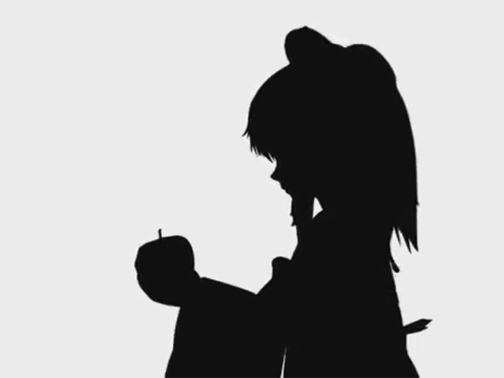
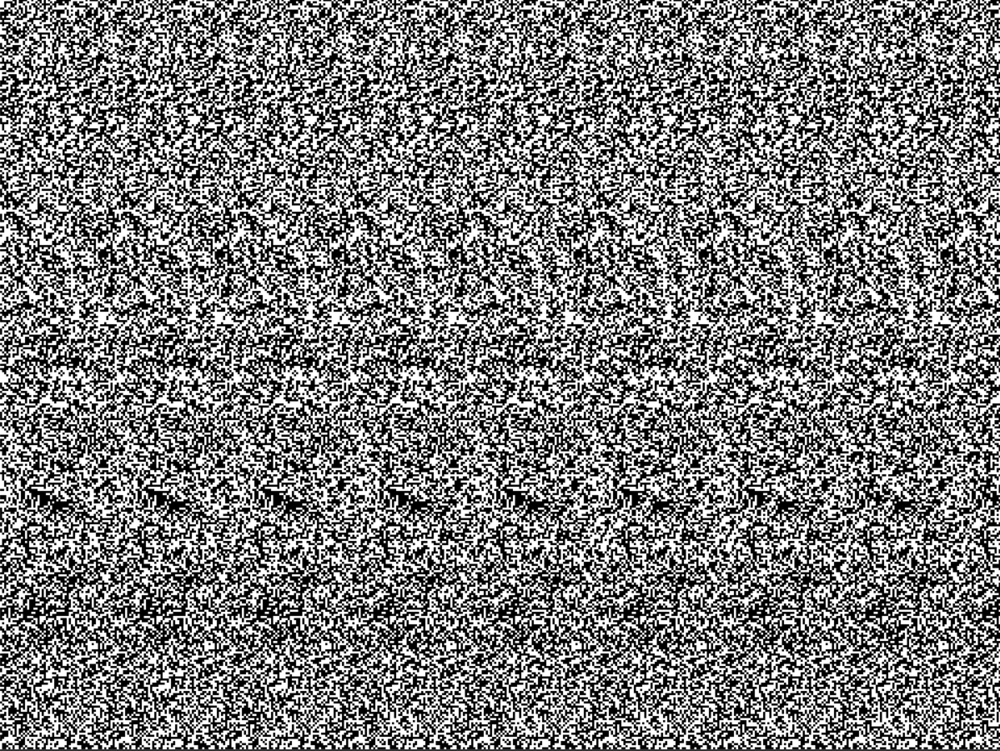

# bad-apple-stereogram

## Setup/usage

Download https://www.youtube.com/watch?v=FtutLA63Cp8 in 360p and save it to "bad-apple.mp4".

Required libraries: SDL2, FFMpeg libraries

Compile with: `-Wall -pedantic -O2 -pthread -lSDL2 -lavcodec-60 -lavutil-58 -lavformat-60`.

## Key bindings

`space`: pause/unpause

`m`: toggle stereogram/normal mode

`→`/`←`: increase/decrease eye distance

`↑`/`↓`: increase/decrease depth